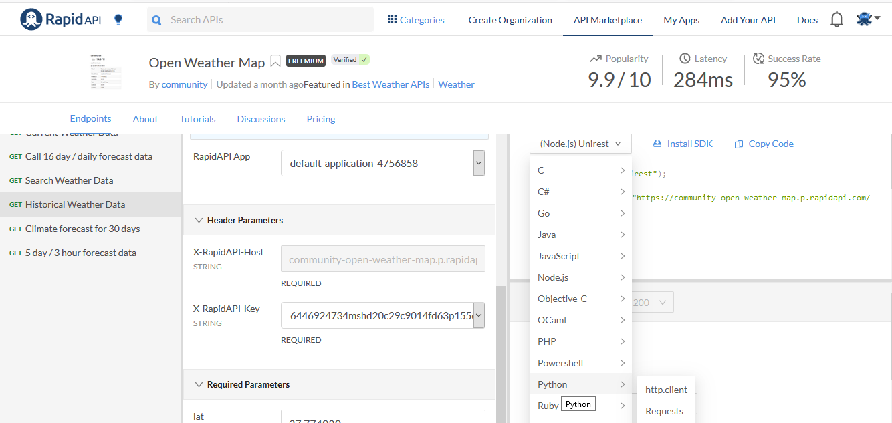
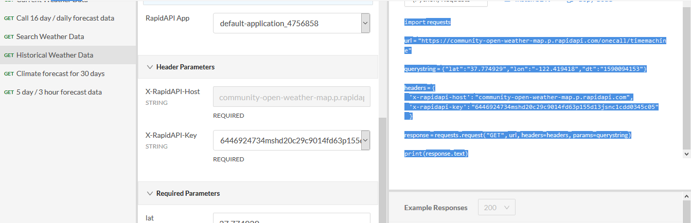

# Small_Wheater_Project
## This program makes it possible to consume a weather API, which allows you to collect data from a city and do some treatments, and in addition, you can also get graphs.

#### Here you will find, a guide with all the procedures to make this little climate program. 

Below are the procedures, which are arranged in 3 stages.

***1. Stage) register an account on the RapidAPI website***

   1. You need to register an account on the RapidAPI website to get an API key

   

   2. Go to API Marketplace on navbar and digit **Open Weather Map** on search text area

   

   3. Now that you have the Key API, choose the Historical Weather Data option
    
   
   
   4. Grab the code and copy to your editor 
    
   
    
    
For more information visit the [How to use an API with Python (Beginner’s Guide)](https://rapidapi.com/blog/how-to-use-an-api-with-python/) on RapidAPI website!


***2. Stage) Build The program*** 

Below, you can see all the functionalities in my program and its corresponding functions, with all the packages that you need to install 

   * Function to grap informations that the API gives (Weather_City) \
```pip install requests``` \
```pip install pprintpp```
   * Function to convert Timestamp to human date (Epoch_to_Datetime) \
```pip install DateTime```   
   * Function to place the data of a chosen weather feature in a list or dictionary (Hourly_features)
   * Function to get the average of a chosen weather feature (Average)
   * Function to get the maximum value of a chosen weather feature (Max)
   * Function to get the minimum value of a chosen weather feature (Min)
   * Function to get graphic of a chosen weather feature (Graphics) \
```pip install matplotlib```

***3. Stage) Inputs to use the program*** 
   * Choose a city
   * Get the latidude of the chosen city
   * Get the longitude of the chosen city
   * Get the Dt (timestamp) of the chosen city
